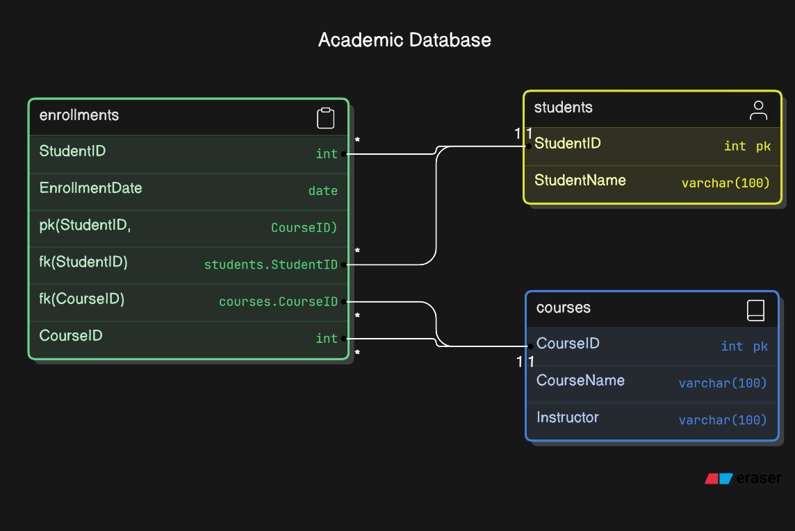

# PostgreSQL資料庫管理

## Reference
- [PG SQL](https://pg-sql.com/)
- [Postgres.app](https://postgresapp.com/)
- [DiagramGPT](https://www.eraser.io/diagramgpt?source=post_page-----1b10079b9b5f--------------------------------)
- [PostgresQL 中文手冊](https://docs.postgresql.tw/16)

## 資料庫是什麼

### SQL 結構式查詢語言
美國國家標準與技術研究院 （NIST），稱為 SQL、結構化查詢語言(Structured Query Language)或稱之為 Simple Query Language。結構式查詢語言 (SQL) 是一種用於在關聯式資料庫中儲存和處理資訊的程式設計語言。關聯式資料庫以表格形式儲存資訊，列和欄代表不同的資料屬性和資料值之間的各種關係。您可以使用 SQL 陳述式來儲存、更新、移除、搜尋和擷取資料庫中的資訊。您也可以使用 SQL 來維護和優化資料庫效能。

### SQL vs NoSQL

一個 NoSQL 數據庫的特性是**靈活的數據結構**。以 MongoDB 為例，它使用文檔導向的數據模型，允許以 JSON 類似的格式儲存數據。這裡是一個範例：

#### SQL 資料結構

**PostgreSQL**
```
CREATE TABLE users (
    id SERIAL PRIMARY KEY,
    name VARCHAR(100),
    age INT,
    email VARCHAR(100)
);
```
**SQL Server**
```
CREATE TABLE users (
    id INT IDENTITY PRIMARY KEY,
    name VARCHAR(100),
    age INT,
    email VARCHAR(100)
);
```
**SQLite**
```
CREATE TABLE users (
    id INTEGER PRIMARY KEY AUTOINCREMENT,
    name VARCHAR(100),
    age INT,
    email VARCHAR(100)
);
```
```
INSERT INTO users (name, age, email) VALUES ('annie','33','annie@gmail.com');
```

```
UPDATE table_name 
set col_name = value 
where rule;
```

```
ALTER TABLE table_name
add col_name type;

ALTER TABLE table_name
ALTER COLUMN col_name TYPE new_type;
```

```
DROP TABLE table_name
CASCADE;
```

#### NoSQL（MongoDB）資料結構
```json
{
    "_id": "1",
    "name": "Alice",
    "age": 30,
    "email": "alice@example.com",
    "address": {
        "street": "123 Main St",
        "city": "Wonderland"
    },
    "interests": ["reading", "hiking"]
}
```

在這個例子中，MongoDB 允許每個用戶文檔有不同的字段（如 `address` 和 `interests`），而 SQL 數據庫則要求所有記錄遵循相同的結構。這樣的靈活性使得 NoSQL 更適合處理變化頻繁或多樣化的數據。

建立一個內容管理系統（CMS）的資料結構可以包含多個集合，以滿足不同的需求。以下是一個基於 MongoDB 的簡單 CMS 資料結構範例：

#### 1. 使用者集合（users）

```json
{
    "_id": "ObjectId",
    "username": "admin",
    "password": "hashed_password",
    "email": "admin@example.com",
    "role": "admin", 
    "created_at": "ISODate",
    "updated_at": "ISODate"
}
```

#### 2. 文章集合（posts）

```json
{
    "_id": "ObjectId",
    "title": "文章標題",
    "content": "文章內容",
    "author_id": "ObjectId",
    "tags": ["tag1", "tag2"],
    "created_at": "ISODate",
    "updated_at": "ISODate",
    "published": true, 
    "comments": [
        {
            "comment_id": "ObjectId",
            "author": "commenter_name",
            "content": "評論內容",
            "created_at": "ISODate"
        }
    ]
}
```

#### 3. 分類集合（categories）

```json
{
    "_id": "ObjectId",
    "name": "分類名稱",
    "description": "分類描述",
    "created_at": "ISODate",
    "updated_at": "ISODate"
}
```

#### 4. 標籤集合（tags）

```json
{
    "_id": "ObjectId",
    "name": "標籤名稱",
    "created_at": "ISODate",
    "updated_at": "ISODate"
}
```

#### 5. 訪問日誌集合（logs）

```json
{
    "_id": "ObjectId",
    "user_id": "ObjectId",
    "action": "create_post", 
    "timestamp": "ISODate",
    "details": {
        "post_id": "ObjectId", 
        "changes": "更改內容"
    }
}
```

#### 說明

- **使用者集合**：儲存使用者資訊，包括角色，以控制訪問權限。
- **文章集合**：包含文章的主要內容，並能夠關聯到作者、標籤和評論。
- **分類集合**：用於將文章組織到不同的類別中。
- **標籤集合**：用於為文章添加標籤，以便更好地分類和搜尋。
- **訪問日誌集合**：記錄用戶的操作，以便進行審計和追蹤。

這個資料結構能夠為一個基本的 CMS 提供支持，可以根據具體需求進一步擴展和調整。

---
## 為什麼選擇 PostgresSQL

- not MySQL(Oracle)

**PostgreSQL vs MySQL**

| 類別 | MySQL | PostgreSQL |
| --- | --- | --- |
| 資料庫技術 | MySQL 是一個純粹的關聯式資料庫管理系統。 | PostgreSQL 是一個物件型關聯式資料庫管理系統。 |
| 功能 | MySQL 對資料庫功能 (例如檢視、觸發程序和程序) 的支援有限。 | PostgreSQL 支援各項最進階的資料庫功能，例如具體化視觀表、*INSTEAD OF* 觸發程序，以及多種語言的預存程序。 |
| 資料類型 | MySQL 支援數字、字元、日期與時間、空間和 JSON 資料類型。 | PostgreSQL 支援所有 MySQL 資料類型，以及幾何、枚舉、網路地址、陣列、範圍、XML、hstore 和複合。 |
| ACID 合規 | MySQL 僅在 InnoDB 和 NDB 叢集存儲引擎方面符合 ACID。 | PostgreSQL 始終符合 ACID。 |
| 索引 | MySQL 具有 B 型樹狀結構和 R 型樹狀結構索引支援。 | PostgreSQL 支援多種索引類型，如表達式索引、部分索引和雜湊索引以及樹狀結構。 |
| 效能 | MySQL 改善了高頻讀取操作的效能。 | PostgreSQL 改善了高頻寫入操作的效能。 |
| 初學者支援 | 開始使用 MySQL 更容易。它為非技術使用者提供了更廣泛的工具集。 | 開始使用 PostgreSQL 更複雜。它為非技術使用者提供了有限的工具集。 |

PostgreSQL 的 ACID 是指數據庫的四個基本特性，用於保證交易的可靠性和一致性。ACID 代表以下四個特性：

1. **原子性 (Atomicity)**：交易要麼完全執行，要麼完全不執行。如果交易中的任何一步失敗，所有已執行的步驟都將被還原，確保數據庫不會處於不一致狀態。

2. **一致性 (Consistency)**：交易必須使數據庫從一個一致的狀態轉變到另一個一致的狀態。在交易開始和結束時，數據庫必須遵循所有的約束條件和規則。

3. **隔離性 (Isolation)**：每個交易的執行不應受到其他交易的干擾。即使多個交易同時執行，它們的結果也應當與逐個執行的結果相同。這是通過不同的隔離級別來實現的。

4. **持久性 (Durability)**：一旦交易被確認，其結果將永久保存，即使系統崩潰或發生其他故障，數據也不會丟失。

這些特性確保了 PostgreSQL 在處理數據時的可靠性和穩定性，使其成為一個強大的數據庫管理系統。

## PostgreSQL架構介紹

PostgreSQL 是一個開源的關聯式資料庫管理系統（RDBMS），它支援 SQL 語法並具備豐富的功能，如事務、並發處理、擴展性以及對 NoSQL 功能的支持（如 JSONB、HStore）。PostgreSQL 的架構是模組化的，提供了靈活性和高效的資源管理，適合各種應用場景。

下面是 PostgreSQL 的主要架構組件介紹：

### 1. **PostgreSQL 整體架構概覽**

PostgreSQL 架構主要分為兩部分：
- **後端（Backend）**：負責資料庫內部邏輯，包括查詢處理、記憶體管理、日誌管理、存儲引擎等。
- **前端（Frontend）**：用戶通過 SQL 語句與資料庫交互，這些語句會經過前端處理，傳遞到後端進行執行。

架構中的主要組件包括：

- **客戶端-伺服器模型**：PostgreSQL 運行在伺服器端，客戶端通過網絡連接來訪問數據庫。
- **共享記憶體（Shared Memory）**：伺服器上的進程共享記憶體區，用來存儲快取和進程之間共享的信息。
- **WAL 機制（Write-Ahead Logging）**：確保資料的一致性和故障恢復。

### 2. **PostgreSQL 架構的核心組件**

#### （1）**Postmaster（伺服器進程）**
Postmaster 是 PostgreSQL 的主進程，負責管理所有其他子進程。當客戶端連接到伺服器時，Postmaster 會為每個客戶端分配一個子進程。

主要功能：
- 負責處理客戶端連接。
- 啟動和停止伺服器。
- 啟動後端進程來執行查詢。

#### （2）**客戶端與伺服器的通訊**
PostgreSQL 使用客戶端-伺服器模型，客戶端通過網絡（TCP/IP 或本地 socket）與資料庫伺服器進行交互。

1. **客戶端**：可以是任何使用 SQL 語句的應用程式或工具（如 `psql` 命令行工具）。
2. **伺服器**：當收到客戶端的 SQL 請求時，伺服器會處理請求，然後將結果返回給客戶端。

#### （3）**Process Model（進程模型）**
PostgreSQL 使用多進程架構，而不是多執行緒架構。每個客戶端連接對應一個伺服器進程。

- **Postmaster 進程**：主要負責監控和管理其他進程。
- **客戶端進程**：每個客戶端連接都會啟動一個子進程來處理查詢。
- **Background Worker 進程**：例如，自動分析、清理、日誌歸檔等操作都有專門的後台進程來執行。

#### （4）**Memory Structure（記憶體結構）**
PostgreSQL 使用兩種類型的記憶體：**共享記憶體（Shared Memory）** 和 **私有記憶體（Private Memory）**。

- **共享記憶體（Shared Memory）**：所有後端進程共享這塊記憶體區，主要存儲快取、WAL 緩衝區和鎖資訊。
  - **Shared Buffer**：這是用來快取資料塊的內存區，避免頻繁的磁碟讀寫操作。
  - **WAL Buffer**：用來快取 WAL 日誌以提高寫入效率。
  - **Lock Table**：用來管理資料庫鎖資訊，協調多進程之間的並發操作。

- **私有記憶體（Private Memory）**：每個後端進程都有自己的私有記憶體，負責處理該進程的臨時數據。
  - **Sort Memory**：用來儲存排序操作的中間結果。
  - **Work Memory**：每個查詢運行時需要分配的工作記憶體。

#### （5）**WAL 機制（Write-Ahead Logging）**
PostgreSQL 使用 WAL 機制來保證數據的一致性和故障恢復。當系統發生故障時，WAL 可以用來恢復資料庫到最近的穩定狀態。

- **WAL 日誌**：WAL 機制會先將即將進行的修改寫入到 WAL 日誌中，只有日誌成功寫入後，資料才會寫入磁碟，這樣可以確保在系統故障時能夠重建數據。
- **檔案恢復**：使用 WAL 來進行故障恢復，將數據恢復到發生故障前的狀態。

#### （6）**查詢處理（Query Processing）**
查詢處理是 PostgreSQL 的核心功能之一。查詢的處理過程如下：

1. **解析（Parsing）**：SQL 查詢會被解析成查詢樹（Parse Tree），檢查語法正確性。
2. **重寫（Rewrite）**：查詢樹可能會根據規則進行重寫，以適應查詢邏輯的優化。
3. **規劃與優化（Planning and Optimization）**：重寫後的查詢樹會被優化，生成執行計劃（Execution Plan）。
4. **執行（Execution）**：優化過的計劃被執行，數據會從資料庫中讀取或修改。

#### （7）**存儲引擎（Storage Engine）**
PostgreSQL 的存儲層負責管理磁碟上的資料存取。所有資料都以頁（page）為單位進行讀寫，每個頁面默認大小為 8 KB。

- **表（Tables）** 和 **索引（Indexes）** 都存儲在檔案系統的資料塊中。
- **MVCC（多版本並發控制）**：PostgreSQL 使用 MVCC 來支援並發操作，這樣每個事務都可以看到一個資料的快照，並發讀寫不會互相阻塞。

#### （8）**事務處理（Transaction Processing）**
PostgreSQL 支援 **ACID（Atomicity, Consistency, Isolation, Durability）**，這保證了資料的一致性和可靠性。

- **事務隔離級別**：PostgreSQL 支援多種事務隔離級別，包括 Read Uncommitted、Read Committed、Repeatable Read 和 Serializable。
- **樂觀鎖與悲觀鎖**：PostgreSQL 提供了樂觀鎖和悲觀鎖的機制來控制資料並發讀寫。

---

### 3. **架構優點**
- **擴展性**：PostgreSQL 支援擴展，可以添加新的資料類型、函數、操作符等。
- **彈性**：除了關聯式資料模型外，PostgreSQL 還支援 JSONB、HStore 等半結構化數據存儲。
- **可靠性**：WAL 機制和 MVCC 保證了數據的一致性、容錯能力和高效並發操作。
- **豐富功能**：支援視圖、觸發器、外鍵、全文本搜索等高級功能。

### 4. 常用的名詞中英對照表：

| 英文名詞             | 中文對照       |
| -------------------- | -------------- |
| Database             | 資料庫         |
| Table                | 資料表         |
| Column               | 欄位           |
| Row                  | 資料列/記錄    |
| Schema               | 結構           |
| Query                | 查詢           |
| Index                | 索引           |
| Primary Key          | 主鍵           |
| Foreign Key          | 外鍵           |
| Constraint           | 約束           |
| Sequence             | 序列           |
| View                 | 檢視表         |
| Transaction          | 交易           |
| Commit               | 提交           |
| Rollback             | 回滾           |
| Backup               | 備份           |
| Restore              | 還原           |
| Trigger              | 觸發器         |
| Function             | 函數           |
| Procedure            | 程式           |
| Role                 | 角色           |
| Privilege            | 權限           |
| Grant                | 賦予           |
| Revoke               | 撤銷           |
| Join                 | 連接           |
| Inner Join           | 內部連接       |
| Outer Join           | 外部連接       |
| Left Join            | 左連接         |
| Right Join           | 右連接         |
| Full Join            | 全連接         |
| Subquery             | 子查詢         |
| Aggregate Function   | 聚合函數       |
| Foreign Data Wrapper | 外部資料包裝器 |
| Extension            | 擴充套件       |
| Operator             | 運算符         |
| Data Type            | 資料型別       |
| NULL                 | 空值           |

### 總結
PostgreSQL 是一個功能強大且靈活的資料庫系統，其架構設計基於多進程模型、共享記憶體、WAL 機制和查詢優化器，提供了高效的並發控制、數據一致性和可擴展性。這使它成為各類應用場景下穩定可靠的選擇。

---

## 安裝 PostgreSQL 

## 我的第一個資料庫


### 試過了？其實還有很多事沒做
**在完成資料庫設計模型之前，有幾個重要的準備工作需要事先完成**，以確保資料庫設計符合需求並具備可擴展性和效能。這些前置步驟有助於理解業務需求、資料流程及資料庫的結構。以下是    設計資料庫模型之前應該完成的工作：

#### 1. **需求分析 (Requirements Analysis)**
   - 了解業務需求，確認系統要解決的問題以及需要儲存的資料類型和範圍。這包括與相關利益相關者（如客戶、開發人員、業務分析師）進行討論，以明確他們的需求。
   - 定義業務規則，理解如何在資料庫中反映這些規則。這些規則可能影響資料的關聯性、完整性和一致性。

#### 2. **資料需求定義 (Data Requirements Definition)**
   - 定義將要儲存在資料庫中的主要資料類型和資料實體（例如，客戶、訂單、產品等）。
   - 確定每個實體的屬性（例如，客戶的姓名、聯絡方式等），並確保這些屬性符合業務需求。

#### 3. **資料流程分析 (Data Flow Analysis)**
   - 分析資料在系統內外的流動方式，識別資料的來源、目的和處理過程。這有助於設計資料輸入和輸出的結構。
   - 確認資料從哪裡來（如外部系統、使用者輸入）、將傳遞到哪裡（如報表、系統其他模組），以及如何處理和儲存這些資料。

#### 4. **實體-關係圖 (Entity-Relationship Diagram, ERD)**
   - 繪製 ERD 圖表，這是一個圖形化的工具，用於表示資料實體和它們之間的關聯。實體-關係圖有助於可視化資料結構，確保每個資料實體及其之間的關聯都清楚定義。
   - 在設計 ERD 時，還需要考慮每個實體的主鍵和外鍵，確保它們之間的關係正確反映在圖中。
     



#### 5. **資料正規化 (Normalization)**
   - 對資料結構進行正規化，將資料分解為多個表格，以減少資料冗餘並確保資料的一致性。常見的正規化過程包括將資料調整到一階正規化 (1NF)、二階正規化 (2NF) 和三階正規化 (3NF)。
   - 這一過程幫助確保每個表格只存放單一實體的屬性，並且沒有重複資料或冗餘。

#### 6. **資料庫效能需求 ( Performance Requirements)**
   - 了解效能要求，如查詢速度、寫入頻率、並發性（多使用者同時存取）等。這將決定資料庫需要如何進行索引、分區或使用其他效能優化技術。
   - 如果系統預期有大量資料讀取或寫入，需提前考慮索引設計、資料分區策略，以及可能的負載平衡解決方案。

#### 7. **資料安全與合規性要求 (Security and Compliance Requirements)**
   - 了解資料的安全性需求，確定哪些資料是敏感的，並規劃相應的加密、存取控制和使用者權限管理。
   - 確認資料庫設計符合當地或國際的數據保護法規（如 GDPR 或 CCPA），確保使用者隱私得到保障，並設計適當的備份和災難恢復策略。

#### 8. **資料庫技術選型 (Technology Selection)**
   - 根據資料性質和系統需求選擇合適的資料庫管理系統（如 MySQL、PostgreSQL、SQL Server、MongoDB 等）。
   - 對於一些應用場景，可能需要選擇關聯式資料庫，而對於一些非結構化資料的需求，則可能選擇 NoSQL 資料庫。

#### 9. **容量與擴展性規劃 (Capacity and Scalability Planning)**
   - 預測資料庫的容量需求（如未來的資料增長量）以及系統的擴展能力。這包括儲存容量的規劃以及資料庫在未來是否能夠有效擴展。
   - 確認資料庫是否需要支持分布式架構，以應對大量並行請求或海量數據。

#### 10. **資料遷移與整合 (Data Migration and Integration)**
   - 如果現有系統有資料需要遷移到新資料庫，則必須詳細規劃資料遷移過程，確保資料的一致性和完整性。
   - 如果新資料庫需要與其他系統進行整合，也需要規劃好資料交換的方式和格式。

#### 總結
資料庫設計是一個複雜的過程，前期準備工作至關重要。從需求分析到資料正規化，再到技術選型和效能、安全考量，這些步驟確保資料庫設計不僅滿足業務需求，還具備良好的擴展性和效能。

---
## 定義資料結構
在關連式資料庫中，原始資料儲存在表格之中，所以在這一章裡，主要說明表格如何建立及調整，以及有什麼樣的功能可以操控所存放的資料。

### 資料型別
PostgreSQL 支援豐富的資料型別，涵蓋數字、文字、日期時間、二進制等。以下是常見的資料型別分類及示例：

#### 1. **數字型別**
- **整數類型**
 - `smallint`: 小範圍的整數，範圍 -32,768 到 32,767（2 bytes）。
 - `integer` 或 `int`: 標準範圍的整數，範圍 -2,147,483,648 到 2,147,483,647（4 bytes）。
 - `bigint`: 大範圍的整數，範圍 -9,223,372,036,854,775,808 到 9,223,372,036,854,775,807（8 bytes）。
```
select 1.123456789::integer as num1;
select 1.123456789::int4 as num2;
select 1.123456789::int8 as num3;
select 1.123456789::bigint as num4;
```
- **浮點數類型**
 - `real`: 單精度浮點數（4 bytes）6 decimal digits。
 - `double precision`: 雙精度浮點數（8 bytes）15 decimal digits。
 ```
 select 1.123456789::real as num1;
 select 1.123456789::double precision as num2;
 ```
 試試看
 ```
 select sum(0.1::real) from generate_series(1,10);
 ```
 新函數：
 - generate_series(1,10)：這是一個 PostgreSQL 內建函數，用來生成一個從 1 到 10 的數字序列；該序列會產生 10 行的結果。
 ```
 SELECT * FROM generate_series(1, 10);
 ```

- **精確數字型別**
 - `numeric(p, s)` 或 `decimal(p, s)`: 精確的數字，`p` 為總位數，`s` 為小數位數。適合金融運算。
 ```
 select 1.123456789::numeric(10,1) as num;
 select 1.123456789::numeric(10,5) as num;
 select 1.123456789::numeric(10,9) as num;
 ```
 試試看
 ```
 select sum(0.1::numeric(2,2)) from generate_series(1,10);
 ```

 1. 新增資料表 **table_numbers**
   - col_numeric numeric(20, 5)
   - col_real real
   - col_bouble double precision

 2. 新增幾筆資料
 ```
 (.8,.8,.8),
 (3.13579, 3.13579, 3.13579),
 (7.0123456789, 7.0123456789, 7.0123456789);
 ```
 3. 確認結果

- **序列和自動遞增型別**
 - `serial`: 自動遞增整數，等同於 `integer` 加上自動生成的序列。
 - `bigserial`: 自動遞增的大整數，等同於 `bigint` 加上自動生成的序列。

#### 2. **字串型別**
- **可變長度字串**
 - `varchar(n)`: 可變長度字串，最多 `n` 個字元。
 - `text`: 不限制長度的字串，通常用於儲存較長的文字。

- **固定長度字串**
 - `character(n)/ char(n)`: 固定長度字串，不足部分會自動填充空格。

試試看

 1. 建立表單 new_tags
 ```
 create table new_tags (
   pk integer not null primary key,
   tag char(10)
 );
 ```
 2. 新增兩筆資料
 ```
 insert into new_tags values (1,'first tag');
 insert into new_tags values (2,'sec tag');
 ```
 3. 使用幾個新函數：
  > ** length()**：這個函數用來計算字串的長度，計算的是字元數，具體根據 tag 中的字元編碼來確定長度。

  > ** octet_length(p)**：計算字串的位元組（byte）數，也就是該字串在資料庫中實際佔用的位元組數量。

  ```
  select pk,tag,length(tag),octet_length(tag) from new_tags;
  ```
 ##### 換你
  1. 刪除 new_tags
  2. 建立新表單 new_tags

    - pk integer not null primary key,
    - tag varchar(10)
  3. 新增幾筆資料
  4. 重複與相同的查詢

#### 3. **布林型別**
- `boolean`: 布林型別，取值為 `TRUE`, `FALSE`, 或 `NULL`。
- TRUE, 'true', 't', 'y', 'yes', '1'
- '11', '00' ?

 1. 建立表單 table_boolean
 ```
 create table table_boolean (
     pk SERIAL primary key,
     user_on_line boolean
 );
 ```
 2. 新增五筆記錄
 ```
 INSERT INTO table_boolean (user_on_line) VALUES(TRUE);
 ```
 3. 修改狀態
 ```
 UPDATE table_boolean set user_on_line = FALASE where pk=1;
 ```
 4. 試試看
   - 將 user_on_line 全變更為 FALSE
   - 找出目前登入的使用者是哪幾個（ where user_on_line=1 ）
   - WHERE user_on_line or WHERE NOT user_on_line
   - 設定初始值
   ```
   ALTER TABLE table_boolean
   ALTER COLUMN user_on_line
   SET DEFAULT '0';
   ```

#### 4. **日期與時間型別**
- `date`: 只包含日期（年、月、日），格式為 `YYYY-MM-DD`。
- `time`: 只包含時間（時、分、秒），格式為 `HH:MI:SS`。
- `timestamp`: 包含日期和時間，無時區信息，格式為 `YYYY-MM-DD HH:MI:SS`。
- `timestamptz`: 包含日期和時間，有時區信息。
- `interval`: 時間間隔，表示時間段（例如，1 天或 2 小時）。

    1. 設定日期
    ```
    select '12-31-2020'::date;
    ```
    2. 更好的設定方式
    > ** to_date() 函數**：將給定的字串轉換為日期。

    ```
    select to_date('04/10/2024','dd/mm/yyyy') ;
    ```
    3. 新增資料表欄位
    ```
    ALTER TABLE table_boolean
    ADD created_on timestamp with time zone DEFAULT CURRENT_TIMESTAMP;
    ```
    4. 調整日期呈現格式
    ```
    select pk,to_char(created_on,'dd-mm-yyyy') as created_on
    from table_boolean;
    ```
    > **to_char() 函數**： 用於將數值或日期型別轉換為指定格式的字串。
    > to_char() 函數是 to_date() 函數的反函數。


#### 5. **二進制資料型別**
- `bytea`: 用於儲存任意二進位資料。可以將任何類型的檔案，例如圖片、PDF、音訊、影片等，直接以其原始的二進位格式儲存到資料庫中。

1. 建立表格
```
CREATE TABLE files (
    id SERIAL PRIMARY KEY,
    filename TEXT,
    data bytea
);
```
2. 新增資料
```
INSERT INTO files (filename, data) VALUES ('image.jpg', E'\\x42696E6172792064617461');
```

#### 6. **列舉型別**
- `enum`: ENUM (Enumeration，枚舉) 型別是一種使用者自定義的資料型別，用來表示一組預定義的值。這些值就像是標籤，用來代表不同的狀態、類別或選項。在 PostgreSQL 中，ENUM 型別提供了一種更安全、更易於管理的方式來儲存這些有限的選擇。

為什麼使用 ENUM 型別？
  - 資料完整性: 確保資料只包含預定義的值，減少資料輸入錯誤的可能性。
  - 可讀性: 使用易於理解的文字表示資料，提高資料的可讀性。
  - 索引效率: ENUM 型別的資料通常會被索引，提高查詢效率。
  - 代碼維護: 減少硬編碼的值，提高代碼的可維護性。

1. 建立列舉型別
```
CREATE TYPE mood AS ENUM ('happy', 'sad', 'neutral');

CREATE TYPE color AS ENUM ('red', 'green', 'blue');
```
2. 建立表單
```
CREATE TABLE products (
id SERIAL PRIMARY KEY,
name TEXT,
color color
);
```
3. 新增資料

ENUM 型別的範例：
- 使用者狀態: user_status AS ENUM ('active', 'inactive', 'deleted')
- 產品類別: product_category AS ENUM ('electronics', 'clothing', 'food')
- 性別: gender AS ENUM ('male', 'female', 'other')
- 付款方式: payment_method AS ENUM ('credit_card', 'paypal', 'bank_transfer')

#### 7. **JSON 與 XML 型別**
專門用來儲存 JSON 格式的資料。它們允許以結構化的方式存儲和查詢 JSON 資料。這兩種型別的主要區別在於儲存的方式和效能表現：

- `json`：存儲原始的 JSON 資料，保留其原始格式，會保留空格、順序等內容。每次查詢時需要重新解析。
- `jsonb`：存儲已解析的二進位格式，順序、空格等無法保留，但效能較好，尤其在進行檢索和索引時。
- `xml`: 用於存儲 XML 資料。

為什麼使用 JSON 型別：
- 靈活性：適合儲存不規則的或動態的資料結構，例如無固定欄位的資料。
- 結合結構化資料：可以在關聯資料庫中，同時使用結構化資料表和 JSON 格式的半結構化資料。
- 索引和效能：JSONB 支持索引，並能快速檢索 JSON 內部的資料。

  1. 建立資料表
  ```
  CREATE TABLE products (
    id SERIAL PRIMARY KEY,
    name VARCHAR(255),
    attributes JSONB
  );
  ```
  2. 新增資料
  ```
  INSERT INTO products (name, attributes)
  VALUES (
    'Laptop', 
    '{
      "brand": "Apple", "model": "MacBook Pro", "price": 2500, 
      "specs": {"ram": "16GB", "storage": "512GB"}
    }'
  );
  ```
  3. 讀取資料
  你可以使用 -> 和 ->> 運算子來提取 JSON 資料。

  - ->：提取 JSON 物件中的子物件。
  - ->>：提取子物件中的純文本值。
  ```
  SELECT name, attributes->'brand', attributes->'model' AS brand
  FROM products;
  
  
  SELECT name, attributes->'specs'->>'ram' AS ram
  FROM products;
  ```
  4. 更新資料
  ```
  UPDATE products
  SET attributes = jsonb_set(attributes, '{price}', '2700')
  WHERE name = 'Laptop';
  ```
  
  5. 換你
     - 新增一筆紀錄
       - pc
         - brand: asus
         - model: 個人電腦
         - price: 23456
       - spacs
         - ram: 8G
         - storage: 256G
     - 讀取新增資料名稱及 model
     - 將 ram 修改成 18G
       
#### 8. **陣列型別**
- PostgreSQL 支援陣列類型，任何資料型別都可以存儲為陣列。例如：

 ```sql
 integer[]  -- 整數陣列
 text[]     -- 字串陣列
 ```

- 陣列可以包含多維結構，例如 `integer[3][3]` 表示三維矩陣。

 1. 建立新表單 table_array
   - id SERIAL,
   - username VARCHAR(64),
   - phones text []
 2. 新增幾筆紀錄
 ```
 INSERT INTO table_array (username, phones)
 VALUES ('troy', ARRAY['(886)981-567-890','(886)933-567-890']);
 ```
 3. 確認結果
 4. 取得每個人的第一筆電話紀錄
 ```
 phone[n]
 ```

#### 9. **UUID 型別**
- **`uuid`**: 通用唯一識別碼(universal unique identifier)，用於儲存 128 位的 UUID 資料。
- ex: **35f61124-81a9-11ef-b198-acde48001122**

 1. enable third part UUID extensions: uuid-ossp
 ```
 CREATE EXTENSION IF NOT EXISTS "uuid-ossp";
 ```
 2. 產生 uuid
 ```
 SELECT uuid_generate_v1();
 ```
 3. 建立表單 table_uuid
 ```
 create table table_uuid (
     pk UUID DEFAULT uuid_generate_v1(),
     product_name VARCHAR(100) not null
 );
 ```
 4. 新增幾筆紀錄
 ```
 INSERT INTO table_uuid (product_name) VALUES ('ff');
 ```
 5. 將 pk 修改成 uuid_generate_v4()
 ```
 ALTER TABLE table_uuid
 ALTER COLUMN pk
 SET DEFAULT uuid_generate_v4();
 ```
 6. 新增幾筆紀錄
    

#### 10. **CIDR 和 INET 型別**
   - `cidr`: 用於存儲 IP 網段。
   - `inet`: 用於存儲 IP 位址（IPv4 或 IPv6）。

#### 11. **點與幾何型別**
   - `point`: 二維平面上的一個點，格式為 `(x, y)`。
   - `line`: 無限直線。
   - `lseg`: 線段。
   - `box`: 矩形。
   - `path`: 路徑。
   - `polygon`: 多邊形。
   - `circle`: 圓形。

#### 12. **範圍型別**
   - `int4range`: 32 位整數範圍。
   - `int8range`: 64 位整數範圍。
   - `numrange`: 數字範圍。
   - `tsrange`: 無時區的時間範圍。
   - `tstzrange`: 有時區的時間範圍。
   - `daterange`: 日期範圍。

#### 13. **貨幣型別**
- `money`: 專門用於儲存貨幣金額，它能夠精確地表示貨幣值，並考慮到不同貨幣的格式和精度。

為什麼使用 money 型別？
- 精確計算: 避免浮點數計算可能產生的精度問題，確保貨幣計算的準確性。

- 格式化輸出: 可以根據不同的區域設定，自動格式化輸出貨幣值，例如加上貨幣符號、千分位分隔符等。

- 內建貨幣功能: PostgreSQL 提供了許多內建函數，方便進行貨幣計算和比較。

  1. 設定 lc_monetary 
  這個設定參數在 PostgreSQL 中扮演著重要的角色，它決定了資料庫如何顯示和處理貨幣值。這個設定會影響到貨幣符號、小數點的位置、千分位分隔符等格式。 
  
    ```
    SET lc_monetary = 'zh_TW.UTF-8';
    ```
  
    常見的區域設定範例
    - 美式英語：en_US.UTF-8
    - 德語：de_DE.UTF-8
    - 法語：fr_FR.UTF-8
    - 中文：zh_CN.UTF-8 或 zh_TW.UTF-8
  
  2. 建立資料表    
    ```
    CREATE TABLE accounts (
        id SERIAL PRIMARY KEY,
        balance money
    );
    ```
  3. 新增資料    
    ```
    INSERT INTO accounts (balance) VALUES (100);
    SELECT * FROM accounts;
    ```
  4. 查詢結果
---
#### PostgreSQL 資料型別簡表

| 資料型別             | 描述           | 長度限制                                    | 預設值  | 說明                                                        |
| -------------------- | -------------- | ------------------------------------------- | ------- | ----------------------------------------------------------- |
| **Integer**          | 整數           | 無限制                                      | 0       | 整數值，包含正數、負數和零。                                |
| **Smallint**         | 小整數         | -32768 到 32767                             | 0       | 小整數，占用較少空間。                                      |
| **BigInt**           | 大整數         | -9223372036854775808 到 9223372036854775807 | 0       | 大整數，占用較多空間。                                      |
| **Serial**           | 自動遞增整數   | 無限制                                      | 1       | 自動遞增整數，常用於自增 ID。                               |
| **Float**            | 單精度浮點數   | 無限制                                      | 0.0     | 浮點數，精度較低。                                          |
| **Double Precision** | 雙精度浮點數   | 無限制                                      | 0.0     | 浮點數，精度較高。                                          |
| **Real**             | 單精度浮點數   | 無限制                                      | 0.0     | 浮點數，精度較低。                                          |
| **Decimal**          | 定點數         | 可定義                                      | 0       | 精確的浮點數，可定義小數位數。                              |
| **Character**        | 字符串         | 1 到 1000                                   | 空字串  | 字符串，長度限制可定義。                                    |
| **Varchar**          | 可變長度字符串 | 1 到 65535                                  | 空字串  | 字符串，長度可變。                                          |
| **Text**             | 長字符串       | 無限制                                      | 空字串  | 長字符串，長度可變。                                        |
| **Boolean**          | 布林值         | 無限制                                      | false   | 布林值，只能為 true 或 false。                              |
| **Date**             | 日期           | 無限制                                      | 無      | 日期格式，例如 2023-10-26。                                 |
| **Time**             | 時間           | 無限制                                      | 無      | 時間格式，例如 14:30:00。                                   |
| **Timestamp**        | 時間戳         | 無限制                                      | 無      | 日期和時間格式，例如 2023-10-26 14:30:00。                  |
| **Interval**         | 時間間隔       | 無限制                                      | 無      | 時間間隔，例如 1 天或 2 小時。                              |
| **Array**            | 陣列           | 無限制                                      | 空陣列  | 陣列，可包含任何資料型別。                                  |
| **JSON**             | JSON 資料      | 無限制                                      | 空 JSON | JSON 格式的資料。                                           |
| **UUID**             | 通用唯一識別碼 | 無限制                                      | 無      | 通用唯一識別碼，例如 a1b2c3d4-e5f6-7890-1234-567890abcdef。 |

**備註:**

* 某些資料型別可能需要額外的設定，例如 `Decimal` 的精度和尺度。
* 上述表格僅列出常見的資料型別，PostgreSQL 提供更多其他資料型別。
* 更多詳細資訊，請參考 PostgreSQL 官方文件: [postgresql.org](https://www.postgresql.org/docs/)


這些是 PostgreSQL 中常見的資料型別，提供了靈活的數據處理和儲存選擇。你可以根據具體應用的需求選擇最合適的型別來構建資料表。

---
## PostgreSQL 常用函數

### 字串函數

1. `CONCAT(string1, string2, ...)`: 連接字串
   - 例: `SELECT CONCAT('Hello', ' ', 'World');` 結果: 'Hello World'

2. `LOWER(string)`: 轉換為小寫
   - 例: `SELECT LOWER('HELLO');` 結果: 'hello'

3. `UPPER(string)`: 轉換為大寫
   - 例: `SELECT UPPER('hello');` 結果: 'HELLO'

4. `LENGTH(string)`: 返回字串長度
   - 例: `SELECT LENGTH('hello');` 結果: 5

5. `SUBSTRING(string, start, length)`: 擷取子字串
   - 例: `SELECT SUBSTRING('hello world', 1, 5);` 結果: 'hello'

### 數值函數

1. `ABS(number)`: 絕對值
   - 例: `SELECT ABS(-10);` 結果: 10

2. `ROUND(number, decimals)`: 四捨五入
   - 例: `SELECT ROUND(3.14159, 2);` 結果: 3.14

3. `CEIL(number)`: 向上取整
   - 例: `SELECT CEIL(3.1);` 結果: 4

4. `FLOOR(number)`: 向下取整
   - 例: `SELECT FLOOR(3.9);` 結果: 3

### 日期時間函數

1. `CURRENT_DATE`: 當前日期
   - 例: `SELECT CURRENT_DATE;`

2. `CURRENT_TIME`: 當前時間
   - 例: `SELECT CURRENT_TIME;`

3. `CURRENT_TIMESTAMP`: 當前日期和時間
   - 例: `SELECT CURRENT_TIMESTAMP;`

4. `DATE_TRUNC(unit, timestamp)`: 日期時間截斷
   - 例: `SELECT DATE_TRUNC('hour', TIMESTAMP '2001-02-16 20:38:40');` 結果: '2001-02-16 20:00:00'

### 轉換函數

1. `CAST(expression AS type)`: 類型轉換
   - 例: `SELECT CAST('100' AS INTEGER);` 結果: 100

2. `TO_CHAR(value, format)`: 將數值或日期轉換為字串
   - 例: `SELECT TO_CHAR(CURRENT_DATE, 'YYYY-MM-DD');`

### 聚合函數

1. `COUNT(*)`: 計數
   - 例: `SELECT COUNT(*) FROM users;`

2. `SUM(column)`: 求和
   - 例: `SELECT SUM(price) FROM products;`

3. `AVG(column)`: 平均值
   - 例: `SELECT AVG(age) FROM employees;`

4. `MAX(column)`: 最大值
   - 例: `SELECT MAX(salary) FROM employees;`

5. `MIN(column)`: 最小值
   - 例: `SELECT MIN(price) FROM products;`

---
## 資料庫正規化

在設計一個教學網站的資料庫時，我們可以使用**PostgreSQL**，並遵循資料庫的**1NF（一階正規化）**、**2NF（二階正規化）** 和 **3NF（三階正規化）** 的規則來設計和優化資料表。以下是每個正規化階段的範例演進。

### 範例：
假設我們設計一個教學網站，系統要記錄課程資訊、學生資訊以及學生的課程註冊情況。

### 1. **一階正規化（1NF）**
**1NF** 要求表格中的每個欄位都只包含**不可分割的值**（即表格是平坦的，每個儲存格只包含一個值），而且每一列應該是唯一的。

#### 原始資料表（未正規化）：
我們將所有課程、學生和註冊資訊放在一個表中，這會導致數據重複和結構不佳。

| StudentID | StudentName | CourseID | CourseName          | Instructor  | EnrollmentDate        |
|-----------|-------------|----------|---------------------|-------------|-----------------------|
| 1         | 王小明 | 101      | 網頁開發      | 潘冬瓜    | 2024-10-01         |
| 1         | 王小明 | 102      | Database Systems     | 王阿花 | 2024-10-02         |
| 2         | 盧小小 | 101      | 網頁開發  | 潘冬瓜 | 2024-10-05         |

在此表中：
- 學生和課程的資訊重複。
- 學生選擇多個課程時，學生名字會被重複列出。

#### 一階正規化（1NF）：
確保每一列的數據是原子性的，**不包含多值欄位**。

```sql
CREATE TABLE Enrollments (
    StudentID INT,
    StudentName VARCHAR(100),
    CourseID INT,
    CourseName VARCHAR(100),
    Instructor VARCHAR(100),
    EnrollmentDate DATE,
    PRIMARY KEY (StudentID, CourseID)
);
```

這樣就滿足了 **1NF**，但仍然有很多數據冗餘（例如 `StudentName` 和 `CourseName` 重複）。

---

### 2. **二階正規化（2NF）**
**2NF** 要求資料表滿足 **1NF**，並且每個**非主鍵屬性**都完全依賴於**主鍵的全部**，不能僅依賴於部分主鍵。

在上面的 `Enrollments` 表中，`StudentName` 只依賴於 `StudentID`，而 `CourseName` 和 `Instructor` 只依賴於 `CourseID`，這些都是部分依賴。

#### 二階正規化（2NF）：
我們將資料分拆成兩個表：一個是關於學生的表，另一個是關於課程的表，然後使用第三個表來表示註冊關係。

1. **Students 表**

| StudentID | StudentName |
|-----------|-------------|
| 1         | John Smith  |
| 2         | Alice Brown |

```sql
CREATE TABLE Students (
    StudentID INT PRIMARY KEY,
    StudentName VARCHAR(100)
);
```

2. **Courses 表**

| CourseID | CourseName          | Instructor  |
|----------|---------------------|-------------|
| 101      | Web Development      | Jane Doe    |
| 102      | Database Systems     | John Carter |

```sql
CREATE TABLE Courses (
    CourseID INT PRIMARY KEY,
    CourseName VARCHAR(100),
    Instructor VARCHAR(100)
);
```

3. **Enrollments 表**

| StudentID | CourseID | EnrollmentDate        |
|-----------|----------|-----------------------|
| 1         | 101      | 2023-01-01            |
| 1         | 102      | 2023-01-02            |
| 2         | 101      | 2023-01-05            |

```sql
CREATE TABLE Enrollments (
    StudentID INT,
    CourseID INT,
    EnrollmentDate DATE,
    PRIMARY KEY (StudentID, CourseID),
    FOREIGN KEY (StudentID) REFERENCES Students(StudentID),
    FOREIGN KEY (CourseID) REFERENCES Courses(CourseID)
);
```

這樣，我們把非主鍵屬性與主鍵的依賴關係完全分開，避免了重複數據的存儲，滿足了**2NF**。

---

### 3. **三階正規化（3NF）**
**3NF** 要求資料表滿足 **2NF**，並且**非主鍵屬性不能依賴於其他非主鍵屬性**（即消除傳遞依賴）。

在 `Courses` 表中，假設未來課程的講師 (`Instructor`) 可能會有更多信息（例如 Email 或 Office 地址），這可能會造成傳遞依賴。如果 `Instructor` 的資訊不僅依賴於 `CourseID`，而是依賴於 `Instructor` 自身，我們需要將講師的信息單獨提取到一個新表中。

#### 三階正規化（3NF）：
我們再將講師資訊拆分出來，這樣就不會有傳遞依賴。

1. **Instructors 表**

| InstructorID | InstructorName | Email           | Office    |
|--------------|----------------|-----------------|-----------|
| 1            | John Smith     | hello@coocle.com| Facebook  |
| 2            | Alice Brown    | troie@wow.com   | Googl     |

```sql
CREATE TABLE Instructors (
    InstructorID INT PRIMARY KEY,
    InstructorName VARCHAR(100),
    Email VARCHAR(100),
    Office VARCHAR(100)
);
```

2. **Courses 表（更新後）**

| CourseID | CourseName          | InstructorID  |
|----------|---------------------|-------------|
| 101      | Web Development     | 1  |
| 102      | Database Systems    | 2 |

```sql
CREATE TABLE Courses (
    CourseID INT PRIMARY KEY,
    CourseName VARCHAR(100),
    InstructorID INT,
    FOREIGN KEY (InstructorID) REFERENCES Instructors(InstructorID)
);
```

3. **Students 表**
保持不變。

4. **Enrollments 表**
保持不變。

---

### 最終結構：
經過 1NF、2NF 和 3NF 的正規化後，資料表變得更加結構化和優化：

1. **Students 表**：
   - 存儲學生的基本信息。
   
2. **Courses 表**：
   - 存儲課程信息和負責講師的 `InstructorID`。

3. **Instructors 表**：
   - 存儲講師的詳細信息。

4. **Enrollments 表**：
   - 表示學生與課程的註冊關係。

### 最終 SQL 查詢範例：
假設我們想查詢每個學生註冊的課程及其講師的詳細信息：

```sql
SELECT s.StudentName, c.CourseName, i.InstructorName, i.Email, e.EnrollmentDate
FROM Enrollments e
JOIN Students s ON e.StudentID = s.StudentID
JOIN Courses c ON e.CourseID = c.CourseID
JOIN Instructors i ON c.InstructorID = i.InstructorID;
```

這樣的正規化結構：
- 消除了數據冗餘。
- 提高了數據完整性。
- 容易進行數據更新和維護，避免數據異常情況（如不同記錄中相同學生的名字拼寫不同）。

## 使用 PostgreSQL 線上教學網站會員管理及課程管理資料表規劃
完成線上教學網站的會員管理及課程管理資料表(schema)：

**1. 會員資料表 (users)**

| 欄位名稱 | 資料類型 |
|---|---|
| id | 會員唯一識別碼 |
| username | 會員帳號 |
| email | 會員電子郵件地址 |
| password | 會員密碼 (建議使用哈希加密) |
| name | 會員姓名 |
| nikename | 會員暱稱 |
| avatar | 會員頭像 URL |
| status | 會員頭像 URL |
| activation key | 會員驗證碼 |
| registered | 會員註冊時間 |
| updated | 會員資料更新時間 |

**2. 課程資料表 (courses)**

| 欄位名稱 | 資料類型 |
|---|---|
| id | 課程唯一識別碼 |
| course name | 課程標題 |
| description | 課程描述 |
| category | 課程類別 |
| price | 課程價格 |
| instructor | 課程講師 |
| image | 課程封面圖片 URL |
| created | 課程創建時間 |
| updated | 課程更新時間 |

**3. 課程學員資料表 (enrollments)**

| 欄位名稱 | 資料類型 |
|---|---|
| id | 學員記錄唯一識別碼 |
| user_id | 會員 ID |
| course_id | 課程 ID |
| progress_rate | 課程完成度 |
| status | 學員狀態 (例如：已報名、已完成、未完成) |
| created | 學員記錄創建時間 |

**4. 課程評論資料表 (reviews)**

| 欄位名稱 | 資料類型 |
|---|---|
| id | 評論唯一識別碼 |
| user_id | 會員 ID |
| course_id | 課程 ID |
| rating | 評分 (例如：1-5 星) |
| comment | 評論內容 |
| created | 評論創建時間 |

**備註:**
* 確保資料庫表結構和資料類型符合您的應用程式需求。
* 使用安全措施保護敏感資料，例如密碼哈希加密。

---
## 載入與搬移資料
1. 修改原始資料檔
   ```受僱員工人數、每人薪資-專業、科學及技術服務業.csv```
2. 建立資料表
  ```
  CREATE TABLE report (
      id INT PRIMARY KEY,                      -- 自動遞增唯一識別碼
      annual INT NOT NULL,                     -- 年度 (如 2024)
      occupation VARCHAR(64) NOT NULL,         -- 職業名稱
      industry VARCHAR(16) NOT NULL,           -- 產業類別
      employee INT,                            -- 員工人數 (不得為負數)
      salary NUMERIC(10, 2),                   -- 月薪，精確到小數點兩位
      annual_salary NUMERIC(12, 2)             -- 年薪，精確到小數點兩位
  );
  ```
3. 匯入資料
   ```data.csv```
4. 確認匯入結果
  ```
  SELECT * FROM report;
  ```

  ```
  SELECT * FROM report 
  WHERE occupation LIKE '%資訊%' 
  ORDER BY salary DESC;
  ```

## 安全性
### 1. 身份驗證

#### 方法：
- 密碼認證
- LDAP
- Kerberos
- 證書認證
- PAM（可插拔認證模塊）

#### 最佳實踐：
- 使用強密碼策略
- 定期更換密碼
- 使用 SSL/TLS 加密連接

### 2. 訪問控制

#### 特性：
- 基於角色的訪問控制 (RBAC)
- 行級安全 (RLS)
- 列級安全

#### 最佳實踐：
- 遵循最小權限原則
- 使用角色來管理權限
- 對敏感數據實施行級安全

### 3. 網絡安全

#### 配置：
- 限制數據庫監聽地址 (`listen_addresses`)
- 使用防火牆限制訪問

#### 最佳實踐：
- 只允許必要的 IP 地址訪問數據庫
- 使用 VPN 或 SSH 隧道進行遠程訪問

### 4. 數據加密

#### 方法：
- 傳輸層加密 (SSL/TLS)
- 數據加密儲存（通過擴展如 pgcrypto）

#### 最住實踐：
- 為所有連接啟用 SSL/TLS
- 對敏感數據使用列級加密

### 5. 審計

#### 特性：
- 詳細的日誌記錄
- 擴展如 pgaudit 提供更詳細的審計功能

#### 最佳實踐：
- 啟用適當級別的日誌記錄
- 定期審查日誌
- 使用審計工具監控敏感操作

### 6. 應用層安全

#### 實踐：
- 使用參數化查詢防止 SQL 注入
- 適當處理錯誤訊息，避免信息洩露
- 使用連接池管理數據庫連接

### 7. 備份和恢復

#### 策略：
- 定期自動備份
- 加密備份數據
- 測試恢復過程

#### 最佳實踐：
- 將備份存儲在安全的異地位置
- 實施時間點恢復 (PITR) 能力

### 8. 系統安全

#### 實踐：
- 及時更新 PostgreSQL 到最新的安全版本
- 限制對數據�器服器的物理訪問
- 加強操作系統安全性

### 9. 配置安全

#### 設置：
- 禁用不必要的擴展和功能
- 正確配置 `pg_hba.conf` 和 `postgresql.conf`

#### 最佳實踐：
- 定期審查和更新配置
- 使用安全掃描工具檢查配置漏洞

### 10. 監控和警報

#### 方法：
- 設置性能和安全監控
- 配置異常行為警報

#### 最佳實踐：
- 使用監控工具持續監視數據庫活動
- 設置自動警報系統應對安全事件

---
## 備份、復原與特定點復原

### 為什麼要備份 PostgreSQL 資料庫？

* **資料安全:** 防止意外刪除、硬體故障、軟體錯誤等導致的資料丟失。
* **災難恢復:** 在發生重大災難時，能夠快速恢復資料庫服務。
* **版本控制:** 可以將資料庫恢復到任意時間點的狀態。

### PostgreSQL 提供的備份方式

* **物理備份:**
    * **pg_basebackup:** 產生一個資料庫叢集的邏輯備份，包括所有資料和 WAL 日誌。
    * **檔案系統快照:** 對於支持檔案系統快照的操作系統，可以對整個資料庫目錄進行快照。
* **邏輯備份:**
    * **pg_dump:** 將資料庫中的資料以 SQL 腳本的形式導出。

### 備份策略

* **完整備份:** 定期進行一次完整的物理備份，作為基礎備份。
* **增量備份:** 在完整備份的基礎上，定期備份新增或修改的數據。
* **WAL 備份:** 持續備份 WAL 日誌，用於進行特定點復原。

### 復原

* **物理備份復原:**
    * 使用 `pg_restore` 命令將物理備份恢復到一個新的資料庫。
* **邏輯備份復原:**
    * 使用 `psql` 命令執行導出的 SQL 腳本。
* **特定點復原:**
    * 基於物理備份和 WAL 日誌，將資料庫恢復到指定的時間點。

### 特定點復原 (Point-in-Time Recovery, PITR)

* **原理:**
    通過 replay WAL 日誌，將資料庫恢復到任意一個一致性狀態。
* **步驟:**
    1. 停止資料庫服務。
    2. 將備份檔案和 WAL 日誌複製到新的位置。
    3. 修改 `postgresql.conf` 檔案，配置恢復目標時間點。
    4. 啟動資料庫，進行恢復。
* **工具:**
    * `pg_basebackup` 和 `pg_walreplay` 命令可以實現 PITR。

### 備份策略建議

* **定期備份:** 建立一個合理的備份計劃，定期進行完整備份和增量備份。
* **保留多個備份:** 保留足夠的備份，以應對不同的故障情況。
* **測試備份:** 定期進行備份恢復測試，確保備份有效。
* **考慮雲端備份:** 將備份資料存儲到雲端，提高數據安全性。

### 示例：使用 pg_dump 和 pg_restore 進行備份和復原

```bash
# 備份
pg_dump -U postgres mydatabase > mydatabase.dump

# 復原
dropdb mydatabase;
createdb mydatabase;
pg_restore -d mydatabase mydatabase.dump
```

### 注意事項

* **WAL 日誌的管理:** WAL 日誌會不斷產生，需要定期清理。
* **備份存儲:** 選擇可靠的存儲介質，並定期檢查備份的完整性。
* **測試環境:** 建議建立一個獨立的測試環境，用於測試備份和復原。

### 更多高級功能

* **流式備份:** 可以將備份數據直接傳輸到遠端伺服器。
* **壓縮備份:** 可以對備份數據進行壓縮，節省存儲空間。
* **加密備份:** 可以對備份數據進行加密，提高安全性。

### 總結

PostgreSQL 提供了多種備份和復原方式，以滿足不同的需求。通過合理的備份策略和工具的使用，可以有效地保護資料庫的安全性。

**建議:**

* **根據業務需求選擇合適的備份方式:** 對於頻繁變化的數據，可以選擇增量備份；對於安全性要求高的數據，可以考慮加密備份。
* **定期測試備份:** 確保備份有效，並及時發現和解決問題。
* **參考官方文檔:** PostgreSQL 官方文檔提供了更詳細的備份和復原指南。

